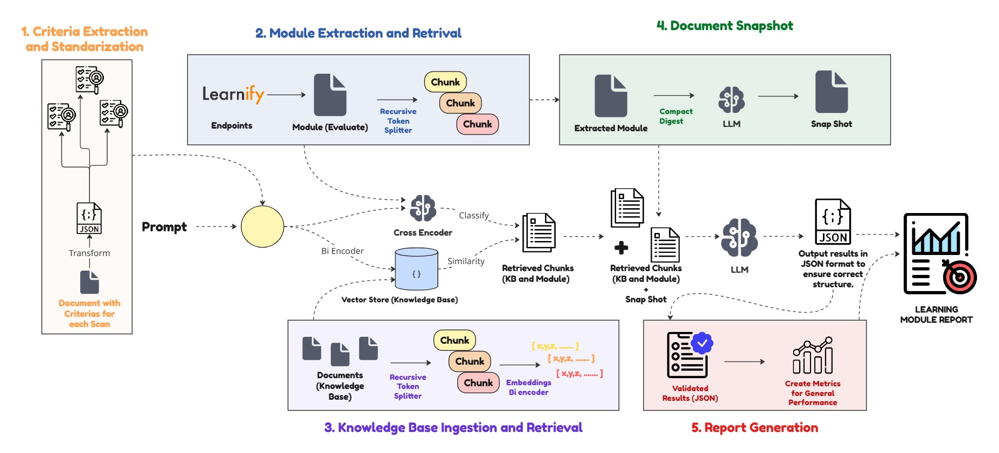

# QIP AI Evaluator

QIP AI Evaluator is an automated evaluation system for digital learning modules hosted on the [Learnify](https://time.learnify.se/) platform.

The solution is designed to support quality improvement processes by assessing educational content against standardized academic rubrics using Artificial Intelligence. It enables institutions and educators to evaluate learning modules in a systematic, consistent, and scalable manner, significantly reducing manual review effort while ensuring pedagogical rigor.

The system analyzes learning modules, generates structured evaluations grounded in course content, and produces actionable feedback and performance reports. These evaluations help identify strengths, gaps, and opportunities for improvement, supporting evidence-based decision-making and continuous enhancement of educational materials.

  

## Usage
### Prerequisites

Before getting started, ensure you need to have [Docker](https://www.docker.com/) installed on your system.

### Components

The project consists of three main components:

-   **RAG API:** Executes the AI evaluation pipeline using Retrieval Augmented Generation, analyzing learning modules against academic rubrics and producing structured evaluation results grounded in course content. Built with [Django](https://www.djangoproject.com/).
-   **Evaluator API:** Serves as the main backend and orchestration layer, managing evaluation requests, coordinating asynchronous tasks, and exposing endpoints to retrieve evaluation progress, results, and reports. Built with [Django](https://www.djangoproject.com/).
-   **Evaluator UI:** A web-based interface that allows users to start evaluations, track their progress in real time, and view or download the generated evaluation reports. Built with [Angular](https://angular.io/).

### Setup

To set up the project you need to clone the repository and then follow these instructions for each component:
- [RAG API Setup](src/README.md)
- [Evaluator API Setup](evaluator_api/README.md)
- [Evaluator UI Setup](evaluator_ui/README.md)

These instructions will guide you through the setup process for all the three components individually, providing step-by-step instructions to get a local development and testing environment up and running with ease.

### Interacting with the Project

To interact with different components of the project, follow these steps:

- **Evaluator UI:** Access the user interface by navigating to [http://localhost:4200](http://localhost:4200) in your web browser.
- **Evaluator API:** Interact with the API endpoints available at [http://localhost:8004](http://localhost:8004).
- **RAG API:** Interact with the API endpoints available at [http://localhost:8005](http://localhost:8005).

### Deployment

The project's containerized architecture ensures easy deployment in a production environment.

You can utilize any container orchestration tool, such as Kubernetes or Docker Swarm, to deploy the services.

Additionally, for efficient handling of HTTP traffic, consider incorporating Nginx into your deployment setup to enhance performance and scalability.

## Authors

 - Santiago Almancy (Universidad Privada Boliviana - UPB)
 - Sebastián Itamari (Universidad Privada Boliviana - UPB)
 - Alex Villazon (Universidad Privada Boliviana - UPB)

## Acknowledgments

This work was partially funded by the Erasmus+ Project “EU-BEGP” (No. 101081473).

  

## License
This project is licensed under the MIT License - see the LICENSE file for details.

## More Information
For more information about the project, please visit our [website](https://eu-begp.org/).